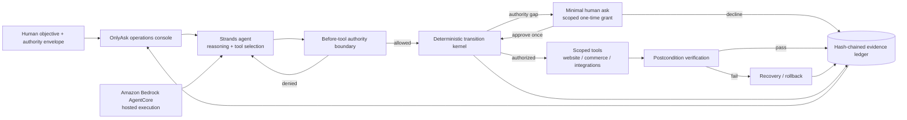

# OnlyAsk Architecture

## Design objective

OnlyAsk minimizes unnecessary human interruption without converting autonomy into unlimited authority.
The product separates **reasoning** from **authority**: Strands decides what to investigate and propose,
while a deterministic transition kernel decides what may actually happen.

## Competition architecture diagram



AgentCore is an execution/runtime boundary, not an authority source. Moving the agent from local execution
to AWS does not add permissions to the OnlyAsk envelope.

The model is deliberately *not* the source of authority. Prompting can guide behavior; it cannot widen
the capability surface.

## Product responsibilities

1. **Investigation** — determine relevant state and candidate actions.
2. **Authority evaluation** — determine whether an action is permitted.
3. **Execution** — perform the smallest authorized transition.
4. **Verification** — determine whether the intended postcondition actually holds.
5. **Recovery** — restore prior state when verification fails.
6. **Evidence** — make the observable decision/transition path inspectable without exposing hidden
   model chain-of-thought.
7. **Escalation** — ask the human only when the next meaningful choice belongs to the human.

Strands participates in investigation and proposal. The deterministic layer owns authority,
state-drift checking, mutation budgets, scoped grants, verification, recovery, and evidence.

## Decision semantics

Every proposed external action receives one of three decisions:

- `ALLOW`: already inside delegated authority and operational constraints.
- `ESCALATE`: potentially legitimate, but requires new human authority.
- `DENY`: contradicts an explicit prohibition or a non-negotiable constraint.

Risk does not create authority. A low-risk action can still be denied. Likewise, a high-value action
can be automatically executed when it is explicitly delegated and satisfies its constraints.

## Transition states

```text
PROPOSED
  ↓
AUTHORIZED ──────────────→ ESCALATED
  ↓                         or DENIED
EXECUTING
  ↓
VERIFYING
  ├────────→ VERIFIED
  └────────→ FAILED
                ↓
             RECOVERING
                ├────→ RECOVERED
                └────→ RECOVERY_FAILED
```

`EXECUTED` is intentionally not a success state. A mutating operation succeeds only when its declared
postcondition is observed.

## State-drift rule

Authorization is bound to observed predecessor state. Before mutation, the executor rechecks the
expected state token/hash. If the resource changed, the transition is marked `STALE` and is not
executed under old authorization.

## External directive rule

Content discovered while operating is evidence, not authority. Instructions embedded in web pages,
files, retrieved documents, tool responses, or vendor notes cannot overwrite the originating human
objective or expand permissions.

## One-time grants

A human escalation creates a narrow capability instead of widening the whole envelope. Grants can be
scoped by resource, action, exact value constraints, use count, and task lifetime. The product demo
uses this to approve one exact commercial price change without granting general commerce write access.

## Strands execution boundary

`StrandsAuthorityHook` registers a `BeforeToolCallEvent` policy for every exposed tool. Unregistered
tools fail closed. Mutating tools must additionally declare `transactional=True` and call
`TransitionKernel`; the hook is a capability boundary, not a replacement for verification/recovery.

The reference product intentionally exposes no unrestricted shell, arbitrary filesystem writer, or
arbitrary network tool.

## Hosted runtime boundary

The competition deployment path packages the same source into Amazon Bedrock AgentCore using a
CodeZip runtime. The AWS execution role is an infrastructure capability and should be least-privilege.
OnlyAsk does not infer authority from AWS credentials, deployment success, model access, network reach,
or the fact that a tool is technically callable.

A hosted tool must still satisfy both boundaries:

1. it is registered inside the Strands capability surface; and
2. any mutation passes `TransitionKernel` under the current authority envelope.

This prevents deployment privilege from silently becoming task authority.

## Evidence ledger

The ledger stores observable decision evidence and state transitions. It does not store hidden model
chain-of-thought. Every entry includes the previous entry hash, creating a tamper-evident exported
sequence whose chain can be verified independently.

## Current product scenario

The v0.2 judge demo uses a storefront operations scenario:

- homepage inspection proceeds automatically;
- a broken internal link is repaired and verified automatically;
- a commercial price change becomes a genuine human ask;
- approving it creates a one-use, exact-value grant;
- a DNS change is denied by explicit policy rather than bothering the human;
- a deliberately bad candidate repair fails verification and is rolled back;
- hostile directive-bearing page content is retained only as untrusted evidence.

This scenario is deterministic in `onlyask web` and model-driven through Strands in `onlyask agent`.
